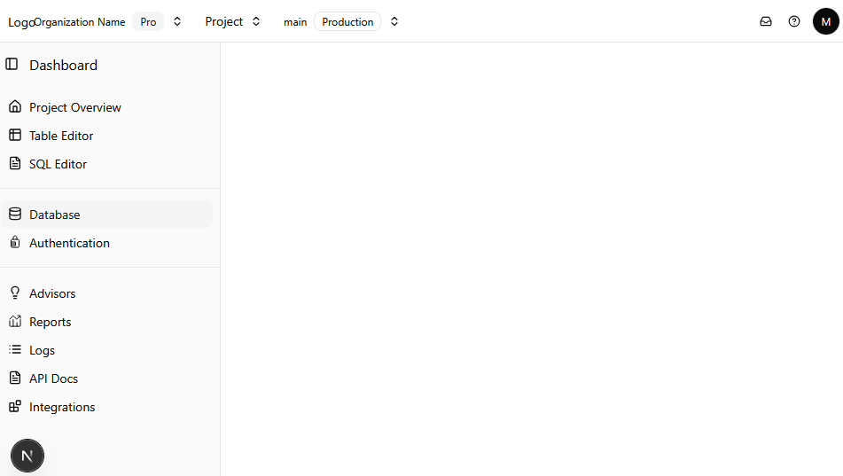

# Next.js Project with Supabase Auth and shadcn/ui

A modern web application built with Next.js 14, featuring Supabase authentication, and a responsive layout with navigation components.



## Features

- 🔐 Supabase Authentication
- 🎨 Responsive Navigation Bar
- 📱 Collapsible Sidebar
- 🌙 Dark/Light Mode Support
- 🔧 TypeScript Configuration
- 📦 Environment Variables Setup
- 🎯 shadcn/ui Components

## Prerequisites

- Node.js 18.x or later
- npm or yarn package manager
- Supabase account and project

## Environment Variables

Create a `.env.local` file in the root directory with the following variables:

```env
NEXT_PUBLIC_SUPABASE_URL=your_supabase_project_url
NEXT_PUBLIC_SUPABASE_ANON_KEY=your_supabase_anon_key
```

## TypeScript Configuration

Ensure you have a `next-env.d.ts` file in your root directory. This file should contain:

```typescript
/// <reference types="next" />
/// <reference types="next/image-types/global" />
```

## Project Structure

```
├── app/
│   ├── components/
│   │   ├── Navbar.tsx
│   │   └── Sidebar.tsx
│   ├── layout.tsx
│   └── page.tsx
├── public/
│   └── project-structure.png
├── types/
│   └── supabase.ts
├── .env.local
├── next-env.d.ts
└── package.json
```

## Installation

1. Clone the repository:
```bash
git clone <your-repo-url>
```

2. Install dependencies:
```bash
npm install
# or
yarn install
```

3. Run the development server:
```bash
npm run dev
# or
yarn dev
```

## Required Dependencies

```json
{
  "dependencies": {
    "@supabase/auth-helpers-nextjs": "latest",
    "@supabase/supabase-js": "latest",
    "next": "14.x",
    "react": "18.x",
    "react-dom": "18.x",
    "class-variance-authority": "^0.7.0",
    "clsx": "^2.0.0",
    "tailwind-merge": "^2.0.0",
    "tailwindcss-animate": "^1.0.7",
    "@radix-ui/react-icons": "^1.3.0"
  },
  "devDependencies": {
    "@types/node": "20.x",
    "@types/react": "18.x",
    "@types/react-dom": "18.x",
    "typescript": "5.x",
    "tailwindcss": "^3.3.0",
    "autoprefixer": "^10.4.16",
    "postcss": "^8.4.31"
  }
}
```

## Authentication Setup

1. Configure Supabase client:

```typescript
import { createClient } from '@supabase/supabase-js'

export const supabase = createClient(
  process.env.NEXT_PUBLIC_SUPABASE_URL!,
  process.env.NEXT_PUBLIC_SUPABASE_ANON_KEY!
)
```

2. Implement authentication in your components:

```typescript
const { data: { user }, error } = await supabase.auth.getUser()
```

## shadcn/ui Setup

1. Initialize shadcn/ui in your project:

```bash
npx shadcn-ui@latest init
```

2. Install components as needed:

```bash
npx shadcn-ui@latest add button
# Add more components as needed
```

3. Components will be added to your `components/ui` directory and can be imported and used in your application:

```typescript
import { Button } from "@/components/ui/button"
```

## Contributing

1. Fork the repository
2. Create your feature branch (`git checkout -b feature/amazing-feature`)
3. Commit your changes (`git commit -m 'Add some amazing feature'`)
4. Push to the branch (`git push origin feature/amazing-feature`)
5. Open a Pull Request

## License

This project is licensed under the MIT License - see the LICENSE file for details.
